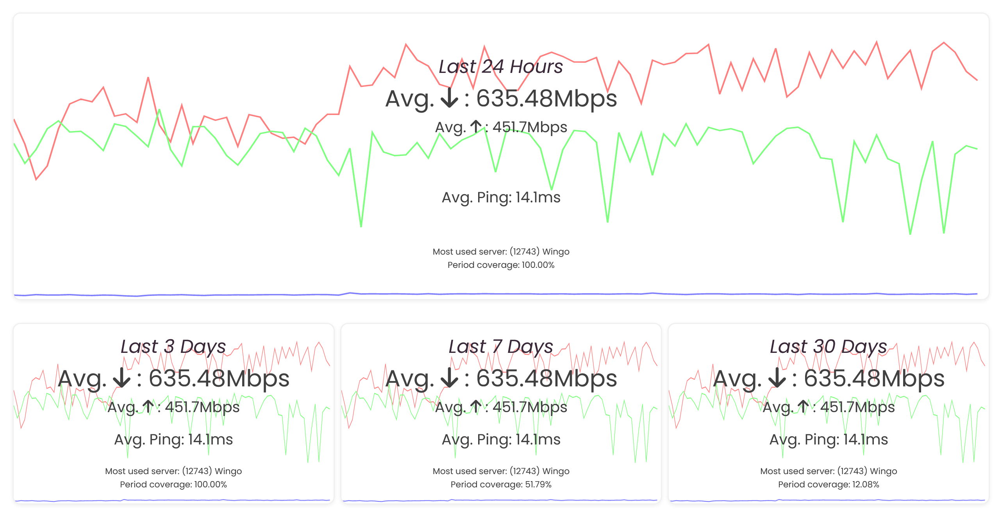

# netspeedstats

A simple, lightweight, automated internet speedtest collector for network speed analysis.

It collects data about internet speed once every `1` hours, `24` collections each day.



# Requirements

- Docker
- Docker Compose
- An Internet connection

# Installation

```bash
docker compose build && docker compose up -d
```

The database is available at port `8889`, the web interface is available at port `8888`.

# License

This software is licensed under the MIT License. See LICENSE file for more information.